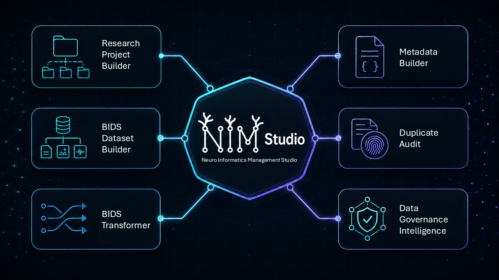

# NIM Studio

**Neuro Informatics Management Studio**  
**Beta version:** 0.1.0-beta  
**Release date:** 16 June 2026  
**Documentation DOI:** [10.5281/zenodo.21296291](https://doi.org/10.5281/zenodo.21296291)

> NIM Studio is currently closed-source beta software. The public repository and Zenodo record provide documentation, citation metadata, release information, and approved examples; they do not distribute the application source code. Only authorized usage is permitted during beta testing. 

## Overview

NIM Studio is a neuroimaging data management desktop application for neuroinformatics and research data management, facilitating FAIR and GDPR data principles, BIDS aligned data wrangling, directory and file administration. It provides an environment for building and maintaining research projects, organizing BIDS-oriented datasets, preparing metadata, planning data transformations, and auditing research storage.

The beta release focuses on making data-organization tasks explicit, reviewable, and reproducible while keeping research data under the user's control.

## Beta status

- Version 0.1.0-beta is an evaluation release under active development. Features, interfaces, file formats, and documentation may change before the first stable release.

- The beta may contain incomplete functionality or defects. Users must review proposed operations and validate all outputs before relying on them in research or operational workflows.

- Access to the executable application is limited to approved beta participants and is governed by the accompanying beta terms. Public availability of this README or the documentation repository does not grant access to, or a licence for, the application.

## Current features

### Research Project Builder

Create configurable research-project structures for administrative, governance, analysis, code, workspace, source-data, and derivative materials.

### BIDS Dataset Builder

Initialize BIDS-oriented dataset structures, participant and session directories, modality-specific folders, source-data areas, and derivatives directories for multimodal research projects.

### BIDS Transformer

Inspect heterogeneous source datasets and prepare structured transfer plans, including proposed subject and session identification, file classification, routing, renaming, dry-run review, and transfer manifests.

### Metadata Builder

Prepare common study and dataset metadata, including templates for `dataset_description.json`, `participants.tsv`, JSON sidecars, and supporting documentation.

### Duplicate Audit

Inspect research storage for exact-content duplicates, filename similarities, and version-like filename patterns. Audit workflows are designed to support review before files are quarantined or otherwise changed.

### Data-governance support

Support consistent project organization, dataset documentation, storage review, and FAIR-oriented research data-management practices.

Availability of individual functions may vary between beta builds. The documentation supplied with a build is the authoritative description of that build.

## Design principles

NIM Studio is developed around the following principles:

- Local-first processing
- Data safety by default
- Reproducible and reviewable operations
- Scientific interoperability
- Transparent data organization
- Sustainable research data management

NIM Studio is designed to operate locally unless a user explicitly enables a separately documented external integration. Users remain responsible for verifying that their deployment and data handling comply with applicable institutional, contractual, ethical, and legal requirements.

## Intended use

NIM Studio is intended to support research data organization and research infrastructure management. It does not replace scientific quality control, institutional governance, information-security review, or professional judgment.

This beta release is not intended for clinical diagnosis, treatment decisions, emergency use, or any other purpose requiring a validated or regulated medical device.

## Installation and access

The public GitHub repository and Zenodo documentation record do not provide the application source code.

Approved beta participants receive a platform-appropriate application package and installation instructions through a controlled distribution channel. Depending on the beta build, distribution may include packages for Windows, macOS, Linux, or Linux/HPC environments.

Do not install NIM Studio from an unofficial source or redistribute a beta package to another person. Verify the version and supplied checksum before installation where a checksum is provided.

## Documentation

The NIM Studio documentation covers:

- Installation and initial configuration
- Research Project Builder
- BIDS Dataset Builder
- BIDS Transformer
- Metadata Builder
- Duplicate Audit
- Data-safety and governance considerations
- Tutorials and synthetic examples
- Known limitations and troubleshooting
- Release-specific changes

Public documentation describes the approved product surface. Internal architecture, proprietary implementation details, credentials, private endpoints, and confidential research material are intentionally excluded.

## Data protection and security

Users are responsible for determining whether they are authorized to process a dataset and for complying with applicable data-protection law, ethics approvals, data-use agreements, institutional policies, security requirements, and retention rules.

Use synthetic or de-identified test data when evaluating a new workflow. Never place participant data, credentials, access tokens, private keys, or confidential institutional information in public issues, documentation, or support requests.

Suspected vulnerabilities or data-security incidents must be reported privately through the official NIM Studio contact channel. Do not disclose vulnerability details in a public GitHub issue.

## Citation

If NIM Studio contributes to research or a scientific output, cite the exact version used:

>  Monteiro, S. (2026). *NIM Studio: Neuroinformatics Management Studio* (Version 0.1.0-beta) [Computer software]. Closed-source beta release. GitHub. https://github.com/arasorietnom/NIM-Studio/

>  Monteiro, S. (2026). *NIM Studio: Neuroinformatics Management Studio* (Version 0.1.0-beta) [Software documentation]. Zenodo. https://doi.org/10.5281/zenodo.21296291

Machine-readable citation metadata is provided in `CITATION.cff`.

When reporting use of NIM Studio, also record the application version, operating environment, relevant workflow configuration, input-data version, and any manual intervention needed to understand or reproduce the work.

## Rights and availability

Copyright © 2026 Sara Monteiro. All rights reserved.

NIM Studio is currently distributed as proprietary, closed-source beta software. The source code, executable application, internal architecture, proprietary implementation, and non-public technical materials are not licensed through the public documentation repository or Zenodo documentation record.

Public access to documentation does not grant permission to reproduce, modify, redistribute, sublicense, reverse engineer, repackage, sell, or commercially exploit NIM Studio. Approved beta use is governed by the terms supplied with the application package. See `LICENSE` and `BETA_POLICY.md` for the documents applicable to this release.

Future versions may be released under different terms. No commitment is made regarding the availability or licensing of future releases.

## Third-party components

NIM Studio may include third-party components governed by their respective licences. Applicable notices and licence texts are provided with distributed application packages. Third-party names, standards, and software remain the property of their respective owners.

## Feedback and contact

Approved beta participants should use the private feedback and support channel provided during onboarding.

Questions concerning beta access, research collaboration, licensing, or security should be directed to the official NIM Studio contact channel. A public contact address will be added to this README once confirmed.
