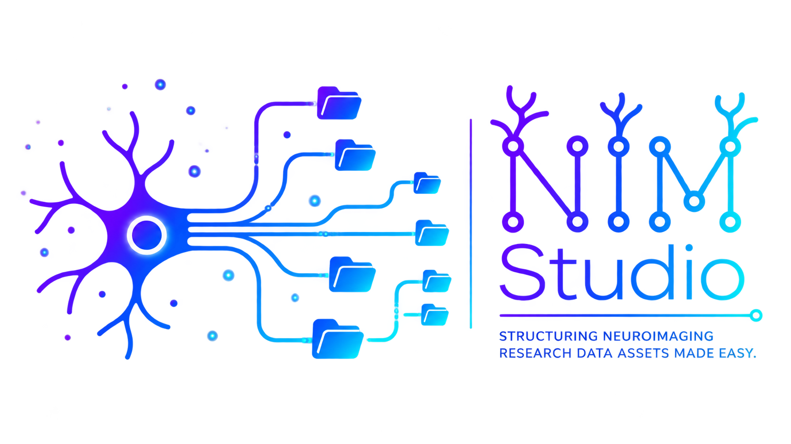

  

  <a href="https://nim-studio.readthedocs.io/"><strong>Documentation</strong></a> ·
  <a href="https://doi.org/10.5281/zenodo.21296291"><strong>Zenodo DOI</strong></a> ·
  <a href="https://research-software-directory.org/software/nim-studio"><strong>Research Software Directory</strong></a> ·
  <a href="https://bio.tools/nim-studio"><strong>bio.tools</strong></a>

---

> [!IMPORTANT]
> **NIM Studio is currently proprietary closed-source beta software.**
> This public repository provides documentation, citation metadata, release information, and approved examples only. It does **not** distribute the application source code or grant public access to the executable. Beta use is restricted to authorized participants.

---

## Overview

**NIM Studio — Neuro Informatics Management Studio** is a local-first desktop application for neuroinformatics and research data management.

It provides an integrated environment for:

`PROJECT STRUCTURE` · `BIDS` · `METADATA` · `DATA TRANSFORMATION` · `STORAGE AUDITING` · `DATA GOVERNANCE`

NIM Studio is designed to support FAIR- and GDPR-aware research data practices, BIDS-aligned data organization, directory and file administration, metadata preparation, structured data transformations, and research-storage review.

The beta release is centered on a simple principle:

> **Make research-data operations explicit, reviewable, and reproducible while keeping research data under the user's control.**

---

## Current release

| Release      | Status                        | Date         |
| ------------ | ----------------------------- | ------------ |
| `0.1.0-beta` | **Active evaluation release** | 16 June 2026 |

Version `0.1.0-beta` is under active development. Features, interfaces, workflows, file formats, and documentation may change before the first stable release.

The beta may contain incomplete functionality or defects. Users must review proposed operations and validate outputs before incorporating them into research or operational workflows.

Access to the executable application is limited to approved beta participants and is governed by the accompanying beta terms. Public availability of this repository or its documentation does not grant access to, or a licence for, the application.

---

## Core modules

  

<table>
<tr>
<td width="50%" valign="top">

### Research Project Builder

Create configurable research-project structures for:

* administration
* governance
* source data
* analysis
* code
* workspaces
* derivatives

</td>

<td width="50%" valign="top">

### BIDS Dataset Builder

Initialize BIDS-oriented dataset structures including:

* participants
* sessions
* modality-specific directories
* source-data areas
* derivatives
* multimodal project layouts

</td>
</tr>

<tr>
<td width="50%" valign="top">

### BIDS Transformer

Inspect heterogeneous source datasets and prepare structured transformation plans including:

* subject identification
* session identification
* file classification
* routing
* renaming
* dry-run review
* transfer manifests

</td>

<td width="50%" valign="top">

### Metadata Builder

Prepare common study and dataset metadata including:

* `dataset_description.json`
* `participants.tsv`
* JSON sidecars
* dataset documentation
* reusable metadata templates

</td>
</tr>

<tr>
<td width="50%" valign="top">

### Duplicate Audit

Inspect research storage for:

* exact-content duplicates
* filename similarities
* version-like filename patterns
* candidate redundant files

Audit workflows are designed around **review before modification**.

</td>

<td width="50%" valign="top">

### Data-governance support

Support consistent:

* project organization
* dataset documentation
* storage review
* FAIR-oriented practices
* governance-aware data handling

</td>
</tr>
</table>

> Availability of individual functions may vary between beta builds. The documentation supplied with each build is the authoritative description of that release.

---

## Design principles

| Principle                       | Meaning                                                               |
| ------------------------------- | --------------------------------------------------------------------- |
| **Local-first processing**      | Research data remain locally controlled by default                    |
| **Data safety by default**      | Potentially destructive operations are review-oriented                |
| **Reproducible operations**     | Transformations should be traceable and repeatable                    |
| **Reviewable workflows**        | Proposed operations should be inspectable before execution            |
| **Scientific interoperability** | Designed around established research standards including BIDS         |
| **Transparent organization**    | Explicit project and dataset structures rather than opaque automation |
| **Sustainable data management** | Supports durable, maintainable research-data practices                |

NIM Studio is designed to operate locally unless a user explicitly enables a separately documented external integration.

Users remain responsible for verifying that their deployment and data handling comply with applicable institutional, contractual, ethical, and legal requirements.

---

## Intended use

NIM Studio is intended to support:

* neuroimaging research data organization
* neuroinformatics workflows
* dataset preparation
* metadata management
* research infrastructure administration
* storage review
* reproducible data-management operations

It does **not** replace scientific quality control, institutional governance, information-security review, or professional judgment.

> [!CAUTION]
> NIM Studio `0.1.0-beta` is **not intended for clinical diagnosis, treatment decisions, emergency use, or any other purpose requiring a validated or regulated medical device.**

---

## Installation and beta access

The public GitHub repository and Zenodo documentation record do **not** provide the application source code or executable.

Approved beta participants receive a platform-appropriate application package and installation instructions through a controlled distribution channel.

Depending on the beta build, distribution may include:

`WINDOWS` · `macOS` · `LINUX` · `LINUX / HPC`

Beta packages must not be redistributed.

Where checksums are supplied, verify both the application version and checksum before installation.

> [!WARNING]
> Do not install NIM Studio from unofficial sources or redistribute a beta package to another person.

---

## Documentation

The complete NIM Studio documentation is available at:

### [Read the NIM Studio documentation →](https://nim-studio.readthedocs.io/)

The documentation covers:

* installation and initial configuration
* Research Project Builder
* BIDS Dataset Builder
* BIDS Transformer
* Metadata Builder
* Duplicate Audit
* data-safety and governance considerations
* tutorials and synthetic examples
* known limitations
* troubleshooting
* release-specific changes

A persistent archival version is available through Zenodo:

**DOI:** [`10.5281/zenodo.21296291`](https://doi.org/10.5281/zenodo.21296291)

Public documentation describes the approved product surface. Internal architecture, proprietary implementation details, credentials, private endpoints, and confidential research material are intentionally excluded.

---

## Software registries

NIM Studio is indexed in research-software registries to support software discoverability, citation, and persistent reference.

| Registry                        | Record                                                                      |
| ------------------------------- | --------------------------------------------------------------------------- |
| **Research Software Directory** | [NIM Studio →](https://research-software-directory.org/software/nim-studio) |
| **bio.tools**                   | [NIM Studio →](https://bio.tools/nim-studio)                                |
| **Zenodo**                      | [Documentation record →](https://doi.org/10.5281/zenodo.21296291)           |

---

## Data protection and security

Users are responsible for determining whether they are authorized to process a dataset and for complying with applicable:

* data-protection legislation
* ethics approvals
* data-use agreements
* institutional policies
* security requirements
* retention requirements

Use synthetic or appropriately de-identified test data when evaluating a new workflow.

Never place participant data, credentials, access tokens, private keys, or confidential institutional information in public GitHub issues, documentation, or support requests.

> [!WARNING]
> Suspected vulnerabilities or data-security incidents must be reported privately through the official NIM Studio contact channel. Do not disclose vulnerability details in a public GitHub issue.

---

## Citation

If NIM Studio contributes to research or a scientific output, cite the **exact version used**.

### Software

> Monteiro, S. (2026). *NIM Studio: Neuro Informatics Management Studio* (Version 0.1.0-beta) [Computer software]. Closed-source beta release. GitHub.

### Documentation

> Monteiro, S. (2026). *NIM Studio: Neuro Informatics Management Studio* (Version 0.1.0-beta) [Software documentation]. Zenodo. https://doi.org/10.5281/zenodo.21296291

Machine-readable citation metadata is provided in [`CITATION.cff`](./CITATION.cff).

When reporting use of NIM Studio, also record:

`SOFTWARE VERSION` · `OPERATING ENVIRONMENT` · `WORKFLOW CONFIGURATION` · `INPUT-DATA VERSION` · `MANUAL INTERVENTIONS`

These details help make software-supported workflows interpretable and reproducible.

---

## Rights and availability

**Copyright © 2026 Sara Monteiro. All rights reserved.**

NIM Studio is currently distributed as proprietary, closed-source beta software.

The source code, executable application, internal architecture, proprietary implementation, and non-public technical materials are **not licensed through this public repository or the associated Zenodo documentation record**.

Public access to documentation does not grant permission to:

* reproduce
* modify
* redistribute
* sublicense
* reverse engineer
* repackage
* sell
* commercially exploit

NIM Studio.

Approved beta use is governed by the terms supplied with the application package.

See:

[`LICENSE`](./LICENSE) · [`BETA_POLICY.md`](./BETA_POLICY.md)

Future versions may be released under different terms. No commitment is made regarding future release availability or licensing.

---

## Third-party components

NIM Studio may include third-party components governed by their respective licences.

Applicable notices and licence texts are supplied with distributed application packages.

Third-party software, standards, names, and trademarks remain the property of their respective owners.

---

## Feedback and contact

Approved beta participants should use the private feedback and support channel supplied during onboarding.

Questions concerning:

`BETA ACCESS` · `RESEARCH COLLABORATION` · `LICENSING` · `SECURITY`

should be directed to the official NIM Studio contact channel.

A public contact address will be added here once confirmed.

---

  

**NIM Studio**
*Neuro Informatics Management Studio*

`LOCAL-FIRST` · `BIDS-ALIGNED` · `REVIEWABLE` · `REPRODUCIBLE`

