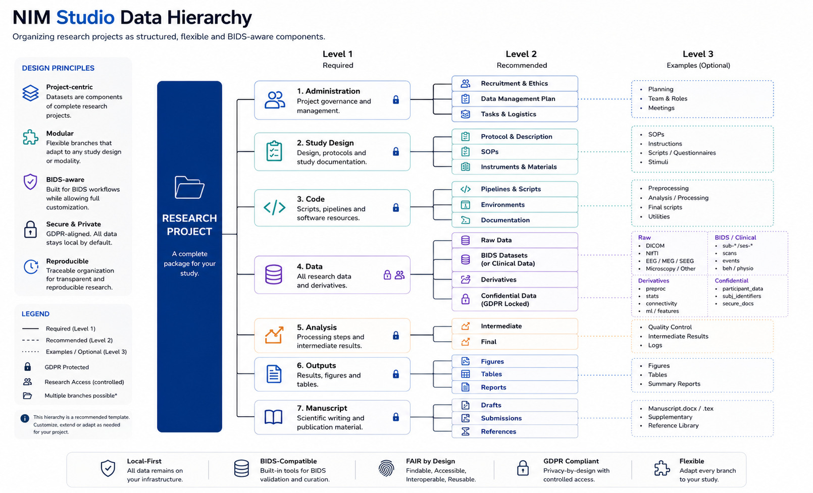

Data Hierarchy
==============

   Proposed hierarchical organization of research projects in NIM Studio.

NIM Studio organizes research using a project-centric hierarchy. Rather than
treating datasets as isolated entities, datasets are considered components of
larger research projects that also include study administration, documentation,
analysis pipelines, outputs, and scientific dissemination.

This approach encourages standardized project organization while remaining
flexible enough to accommodate the diverse requirements of modern
neuroinformatics and multidisciplinary research.

Project-Centric Design
----------------------

The fundamental organizational unit within NIM Studio is the research project.
Each project represents a complete scientific package that may contain one or
multiple datasets together with all associated documentation, code, analyses,
and outputs.

Typical project components include:

* Administrative documentation
* Study design
* Source code and analysis pipelines
* Research datasets
* Intermediate processing
* Final analyses
* Figures and tables
* Manuscripts and publications
* Reference material

This structure aims to keep all research assets organized throughout the entire
research lifecycle.

Datasets as Project Components
------------------------------

Within each project, datasets are managed as independent components. Depending
on the study design, a project may contain:

* A single dataset
* Multiple datasets
* Longitudinal cohorts
* Multi-site studies
* Multi-modal acquisitions
* External reference datasets
* Derived datasets generated during processing

This modular approach enables projects to evolve naturally without requiring
changes to the surrounding project organization.

Support for BIDS
----------------

NIM Studio has been designed with the Brain Imaging Data Structure (BIDS) as
its primary organizational framework for neuroimaging datasets.

Dedicated modules assist researchers in:

* Building BIDS-compatible datasets
* Transforming existing datasets into BIDS
* Validating BIDS compliance
* Organizing derivatives
* Generating metadata and sidecar files

When datasets follow the BIDS specification, NIM Studio preserves the standard
directory hierarchy while integrating it seamlessly into the broader project
structure.

Flexible by Design
------------------

Although BIDS serves as the preferred standard for neuroimaging workflows, NIM
Studio is intentionally not restricted to a single organizational model.

Researchers may adapt project structures according to the specific needs of:

* Research laboratories
* Clinical studies
* Student projects
* Teaching environments
* Pilot studies
* Large collaborative consortia
* Multi-centre cohorts
* Multi-modal research designs
* Non-BIDS datasets

Individual folders, branches, and metadata structures can therefore be
extended or customized without affecting the remainder of the project.

Recommended Hierarchy
---------------------

The hierarchy shown above illustrates a recommended organizational template
rather than a mandatory directory structure.

Level 1 folders represent the core components required by most research
projects.

Level 2 folders provide a standardized organization suitable for the majority
of scientific workflows.

Level 3 folders demonstrate possible examples that researchers may modify,
extend, rename, or replace according to their own study requirements.

Consequently, NIM Studio combines standardization where it improves
interoperability with flexibility where individual research designs require
customization.

Benefits
--------

The project-centric hierarchy provides several advantages:

* Standardized project organization across studies.
* Improved discoverability of research assets.
* Natural integration with BIDS workflows.
* Support for FAIR research data management.
* Simplified collaboration between research groups.
* Flexibility for diverse study designs and data modalities.
* Scalable organization from student projects to institutional research
  infrastructures.
