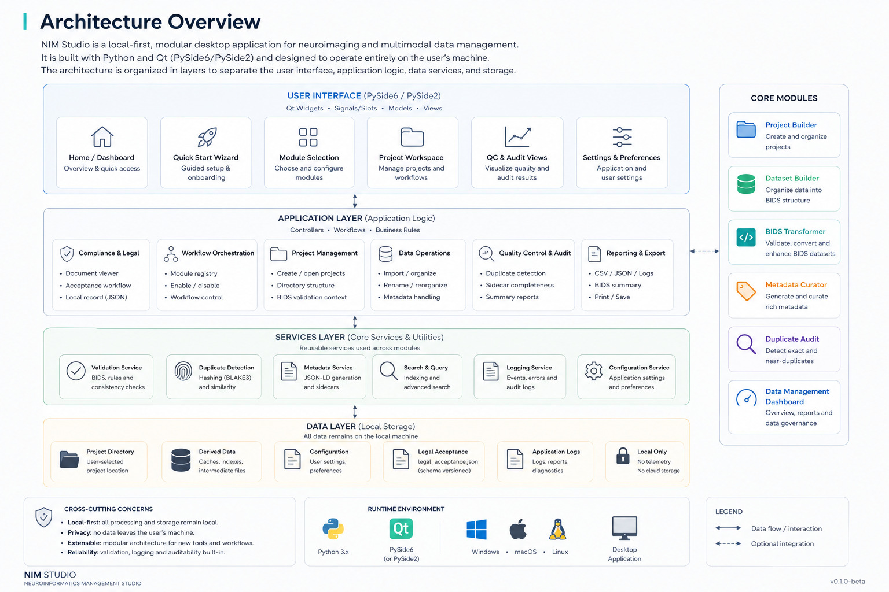

Software Architecture
=======================

NIM Studio is designed as a modular, local-first desktop platform for
neuroinformatics, research data management, and reproducible scientific
workflows. Rather than providing a single monolithic application, the software
consists of independent modules that share a common infrastructure while
remaining interoperable.

The architecture emphasizes transparency, extensibility, and data safety,
allowing researchers to organize, curate, validate, and audit research data
without relying on external cloud services.

Architectural Principles
------------------------

NIM Studio is developed around six core principles:

* **Local-first processing** – All operations are performed on the user's
  workstation unless explicitly configured otherwise.
* **Modularity** – Individual tools can operate independently or be combined
  into complete workflows.
* **BIDS compatibility** – Dataset organization follows established
  neuroimaging standards wherever applicable.
* **Reproducibility** – Generated outputs are deterministic, documented, and
  suitable for reproducible research.
* **Interoperability** – Standard file formats and metadata schemas facilitate
  integration with existing neuroinformatics ecosystems.
* **Scalability** – The framework supports both small laboratory projects and
  large collaborative research infrastructures.

System Architecture
-------------------

The application is organized into several architectural layers.

.. figure:: ../_static/NIM_architecture.png
   :align: center
   :width: 100%

   High-level architecture of NIM Studio.

User Interface
^^^^^^^^^^^^^^

The graphical user interface provides access to all available modules through a
common workspace. Users configure projects, select workflows, monitor progress,
and review generated outputs without requiring command-line interaction.

Application Layer
^^^^^^^^^^^^^^^^^

The application layer coordinates user workflows, project management,
validation routines, reporting, and communication between modules. It provides
the central orchestration logic while remaining independent of any specific
scientific workflow.

Core Services
^^^^^^^^^^^^^

Several reusable services are shared across all modules, including:

* Metadata generation
* Duplicate detection using BLAKE3 hashing
* BIDS validation
* Logging and reporting
* Configuration management
* Search and indexing

These shared services ensure consistent behaviour throughout the application.

Local Data Layer
^^^^^^^^^^^^^^^^

NIM Studio stores all project information locally. Depending on the selected
modules, the data layer may contain:

* Research projects
* BIDS datasets
* Metadata files
* Reports
* Configuration files
* Application logs

No external storage is required for standard operation.

Module-Based Design
-------------------

Each major capability of NIM Studio is implemented as an independent module.
Current beta modules include:

* Project Builder
* Dataset Builder
* BIDS Transformer
* Metadata Curator
* Duplicate Audit
* Data Management Dashboard

Modules share a common infrastructure while remaining loosely coupled. This
design allows new functionality to be added without affecting existing
components and enables users to construct workflows tailored to their research
needs.

Benefits
--------

The modular architecture provides several advantages:

* Simplified maintenance and development
* Consistent user experience across tools
* Reusable services shared between modules
* Easier integration of future functionality
* Improved software scalability
* Long-term sustainability of the platform
