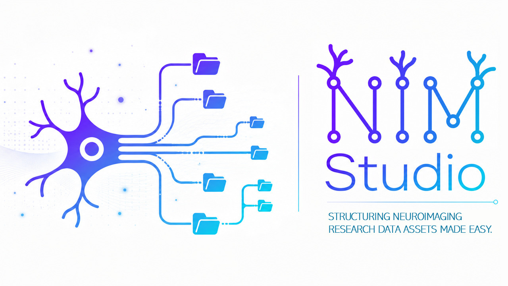

NIM Studio Documentation
========================

Neuroinformatics Management Studio
----------------------------------

NIM Studio is a local-first platform for neuroinformatics, BIDS organization,
metadata generation, duplicate auditing, and scalable research data
management.

Overview
--------

NIM Studio provides a unified environment for:

* BIDS-compatible project creation
* Metadata generation and management
* Duplicate auditing using BLAKE3
* Research data organization
* Data governance
* Research infrastructure automation
* Local-first workflows
* Reproducible neuroinformatics pipelines

Design Principles
-----------------

NIM Studio is developed around:

* Reproducibility
* Local-first processing
* Transparency
* Data safety
* Scalability
* Human-readable workflows
* Scientific interoperability

.. toctree::
   :maxdepth: 2
   :caption: Getting Started

   installation
   quickstart

.. toctree::
   :maxdepth: 1
   :caption: In-App Modules

   modules/structuring/project_builder
   modules/structuring/dataset_builder
   modules/structuring/bids_tool
   modules/structuring/metadata_builder
   modules/governance/data_management
   modules/governance/duplicate_audit

.. toctree::
   :maxdepth: 2
   :caption: Framework

   framework/governance_model
   framework/nim_architecture
   framework/data_hierarchy
   framework/data_flow
   framework/bids_compliance
   
.. toctree::
   :maxdepth: 2
   :caption: About

   license
   citation
   
